# HRS Human Resources System — Product Overview

**Product:** HRS (Human Resources System)  
**Platform:** xWork  
**Audience:** All Employees, HR Administrators, Organization Administrators  
**Version:** V1.0  
**Release Date:** July 2026

---

## 1. Background

Ashley Furniture, as a global leader in furniture manufacturing, operates a large and complex organizational structure with employees distributed worldwide. Previously, HR information was scattered across multiple systems and manual spreadsheets, causing:

- **Data silos** — Organizational changes and transfers could not be synchronized in real time
- **No version history** — Historical states of organizations and employees could not be traced
- **Low collaboration efficiency** — Cross-department reporting-line queries required multiple rounds of communication

HRS was built to solve these problems — a unified platform to manage organizations, positions, and employees across their full data lifecycle, now enhanced with an AI Assistant for natural language queries and task execution.

---

## 2. Value Proposition

| Value | Details |
|---|---|
| **Single Source of Truth** | Organizations, positions, and employees managed centrally — no more information silos |
| **Timeline Version History** | Every change is recorded as a versioned entry; any historical state can be reviewed |
| **Visual Org Chart** | Horizontal and vertical views of reporting hierarchies, with export support |
| **Drill-down Navigation** | Click any org card to drill into its employees, positions, and job roles |
| **Dual Reporting Lines** | Clearly records both Operational and Functional reporting relationships |
| **AI-Powered Queries & Actions** | Ask questions and execute HR tasks in plain English via the AI Assistant |

---

## 3. Core Modules

### 3.1 Organization Management

Manage Ashley's global organizational structure with multi-level tree support.

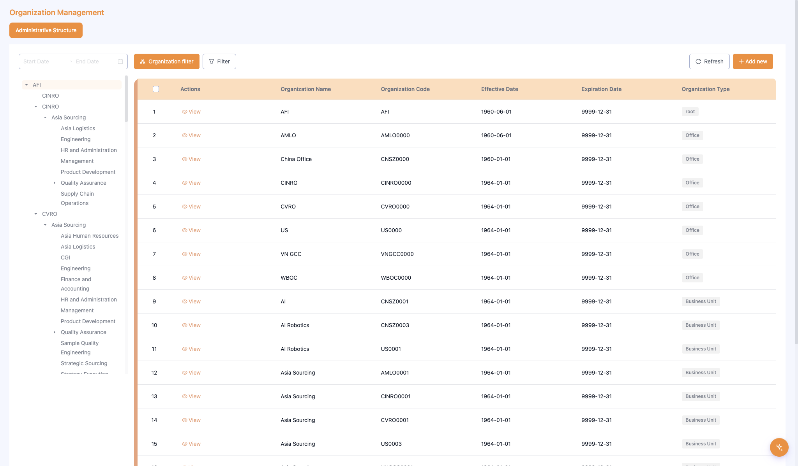

**Layout:** Collapsible org tree on the left (full AFI global hierarchy); organization data table on the right; filter and action buttons at the top.

**Key Features:**
- **Organization List** — View all organizations, filterable by date range
- **Organization Detail** — Full org info including effective date, expiry date, and organization type
- **Timeline Versions** — Visualize the history of an organization; click any node to view version details
- **Version Actions** — Add, edit, or delete organization versions
- **Org Actions** — Add, deactivate, reactivate, or delete pending org versions

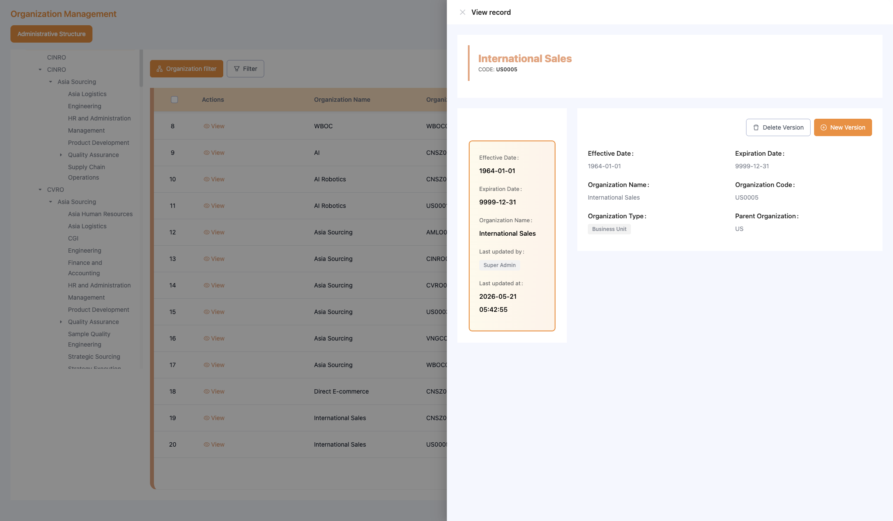

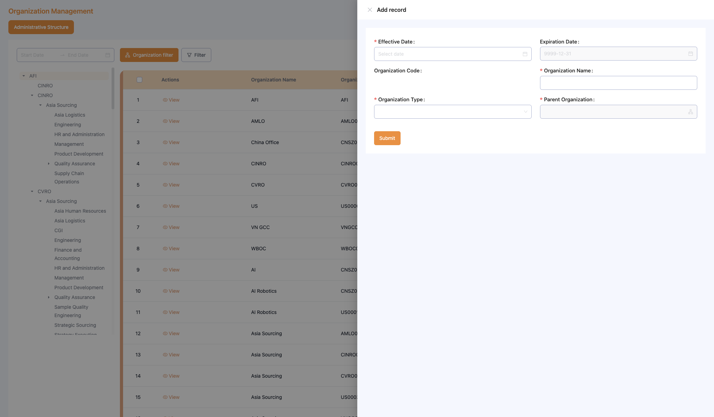

**Table Fields:** Org Name / Org Code / Effective Date / Expiry Date / Org Type

---

### 3.2 Employee Management

Manage all active and inactive employee records, deeply linked to organizations and positions.

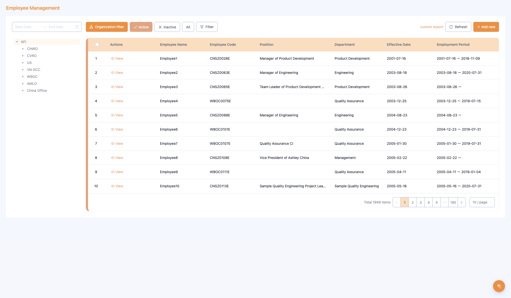

**Layout:** Org tree on the left for department filtering; employee table on the right; status toggle (Active / Inactive / All), export, and add buttons at the top.

**Key Features:**
- **Employee List** — View employees with date-range filter and Active / Inactive / All status toggle
- **Employee Detail** — Full employee record including position, department, tenure, and status
- **Timeline Versions** — Track transfers, promotions, and department changes
- **Version Actions** — Add, edit, or delete employee versions
- **Add Employee** — Create a new employee; system auto-creates the first timeline version
- **Custom Export** — Export employee data with user-selected fields

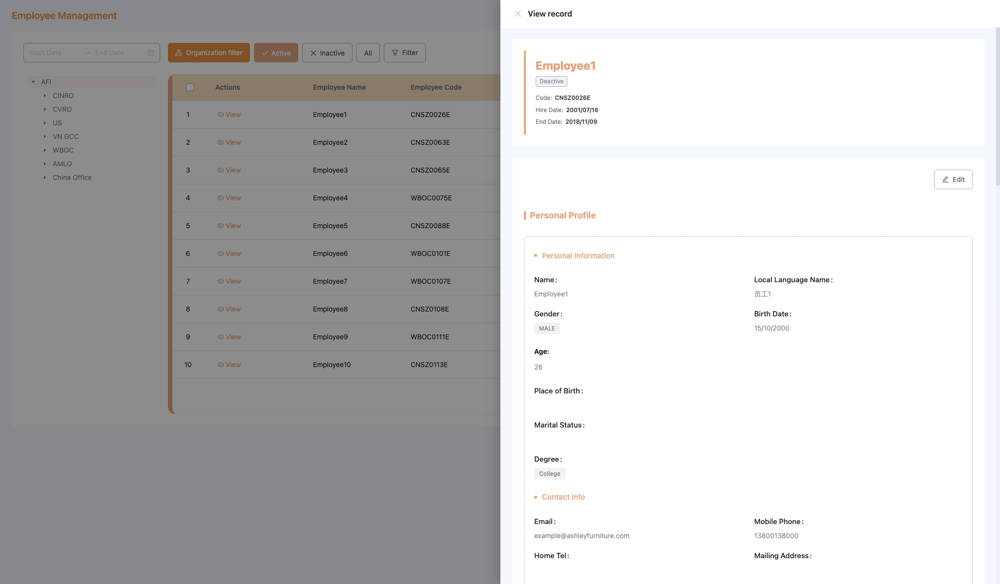

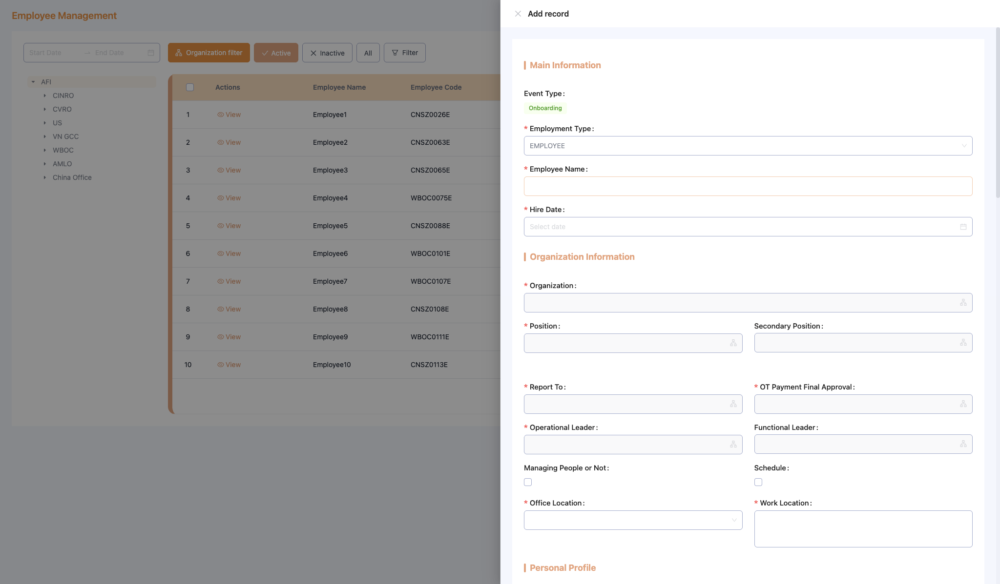

**Table Fields:** Employee Name / Employee Code / Position / Department / Effective Date / Tenure / Status

---

### 3.3 Position Management

Manage the company-wide position framework, linked to organizations and job levels.

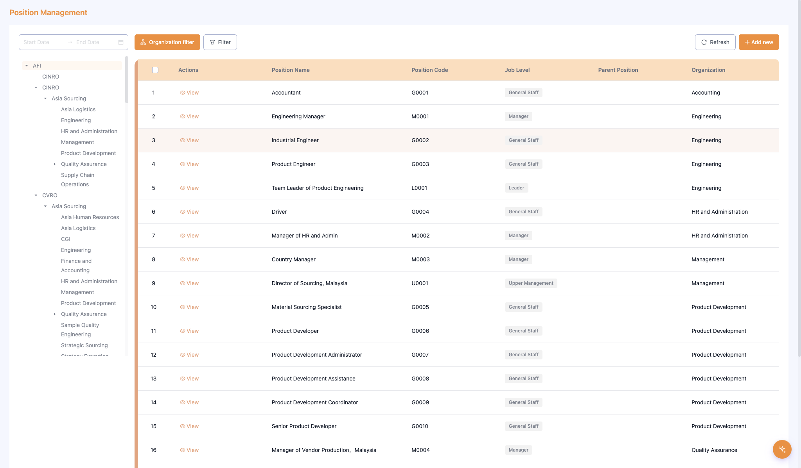

**Layout:** Same left-tree + right-table layout; position data includes job level and parent-child hierarchy.

**Key Features:**
- **Position List** — View all positions with filtering support
- **Position Detail** — Full position info including job level, parent position, and owning org
- **Timeline Versions** — Track position history
- **Version Actions** — Add, edit, or delete position versions
- **Add Position** — Create a new position; system auto-creates the first timeline version

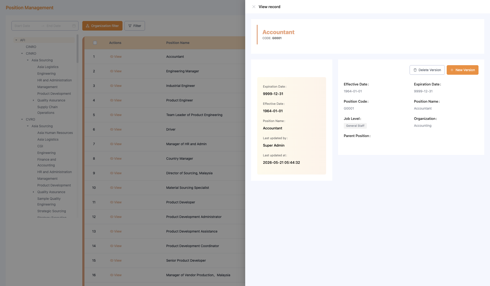

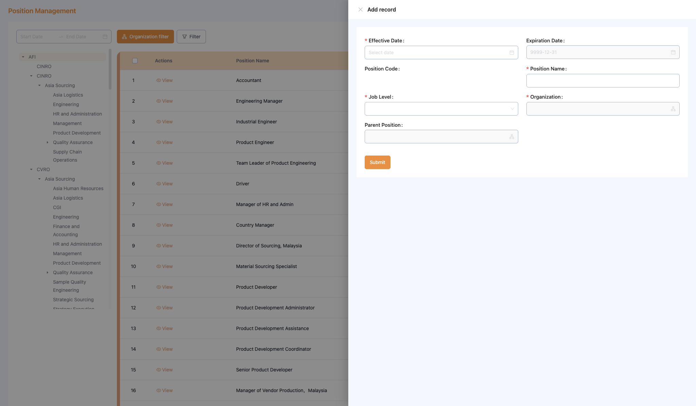

**Table Fields:** Position Name / Position Code / Job Level / Parent Position / Org Unit

---

### 3.4 Employee Reporting Chart

Visualize the organizational hierarchy and reporting relationships as an interactive chart.

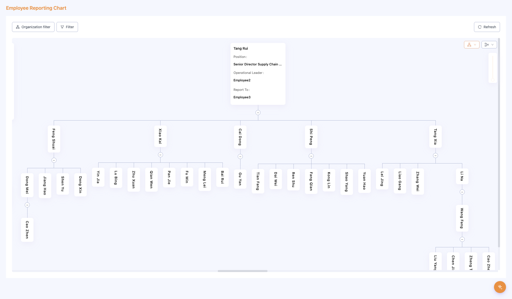

**Layout:** Org tree navigation on the left; interactive org chart cards on the right — each card shows a position's dual reporting relationships.

**Key Features:**
- **Horizontal / Vertical / Compact Views** — Multiple layout modes for different needs
- **Dual Reporting Lines** — Each card shows Operational Leader and Functional Leader
- **Drill-down** — Click employee count, position count, or job count on any card to drill in
- **Export** — Export the org chart as an image or PDF

---

### 3.5 AI Assistant

A conversational AI sidebar built into HRS, accessible from any module. Enables natural language queries and direct task execution without navigating between pages.

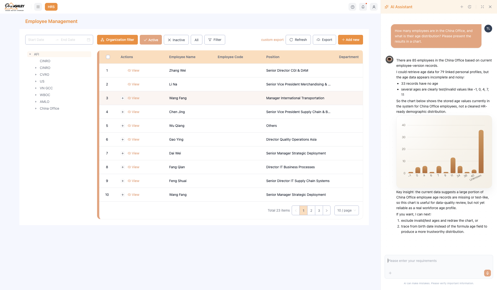

**Two Core Capabilities:**

**Query** — Ask data questions in plain English:
- "How many employees joined this month?"
- "Show me a workforce overview for Asia Sourcing"
- "How many employees left in Q2?"

**Action** — Execute HR tasks via natural language:
- "Add a new employee: John Smith, onboarding July 15"
- "Create a position: HR Specialist under HR Admin, General Staff level"
- "Deactivate org unit: Asia Logistics"

**Key Features:**
- Instant data summaries with breakdown by org unit
- Task confirmation before execution
- Full task history log within the session
- Works across all 4 HRS modules

---

## 4. System Access

| Module | Path |
|---|---|
| Organization Management | xWork → HRS → Organization Management |
| Employee Management | xWork → HRS → Employee Management |
| Position Management | xWork → HRS → Position Management |
| Employee Reporting Chart | xWork → HRS → Employee Reporting Chart |
| AI Assistant | Click the AI icon in any HRS module (right sidebar) |

---

## 5. Integration with Other Systems

HRS serves as the authoritative source of HR data and supports:

- Employee onboarding and offboarding workflows
- Performance management systems (reporting line data)
- Permission management (org unit membership)
- Approval workflows (org hierarchy data)

---

> For step-by-step instructions, see the *User Guide*. For common questions, see the *FAQ*.
