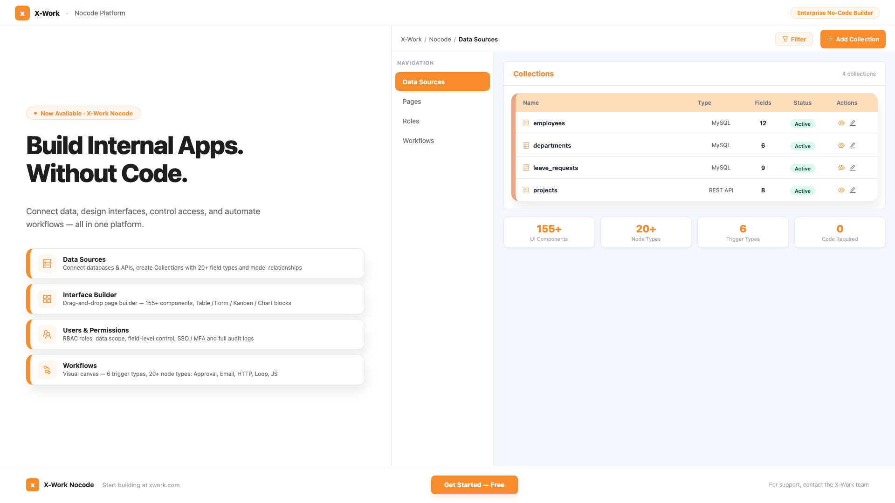
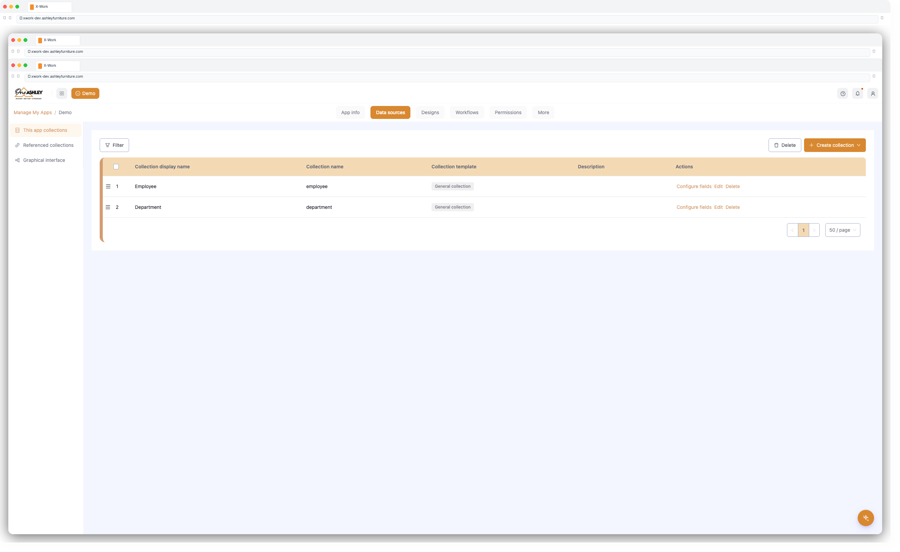
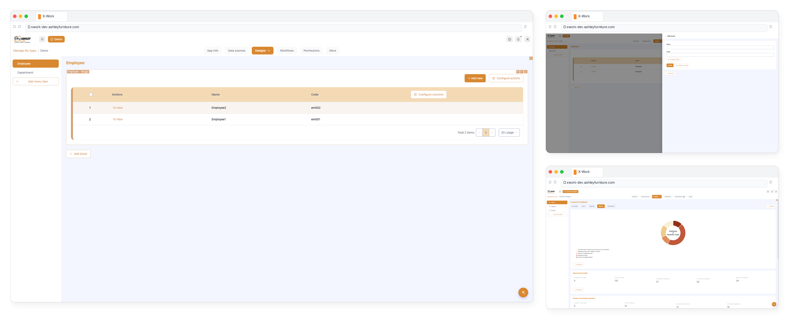
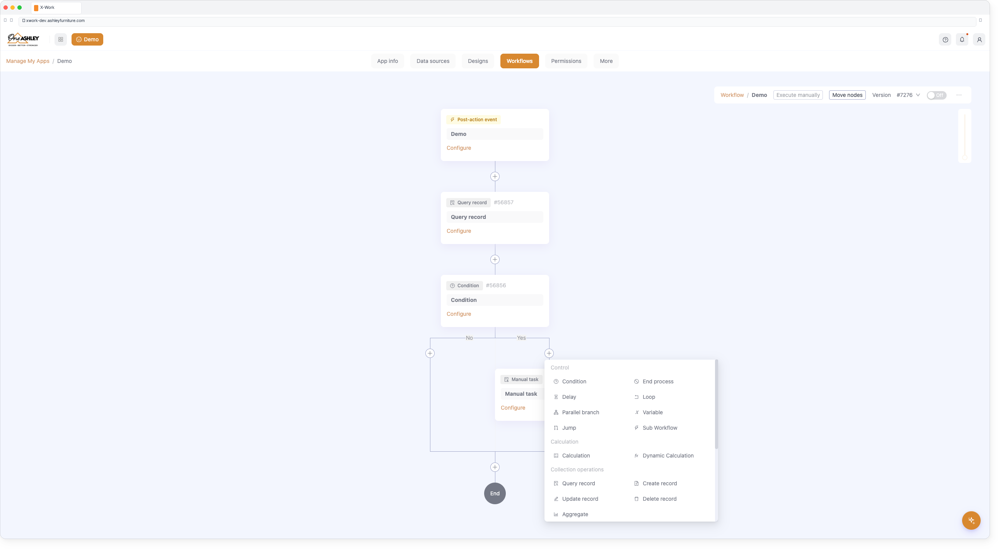

# X-Work — Product Overview

## What is X-Work?

**Scalability-First, No-Code Development Platform.**

Total control, infinite scalability — empowering our team to swiftly adapt to changes and significantly reduce costs. Skip years of development and millions in investment.

---

## Who Is It For?

| Audience | How They Use It |
|----------|----------------|
| Business Analysts | Build data models and reports without IT dependency |
| Operations Teams | Automate repetitive processes and approval workflows |
| Product Managers | Rapidly prototype and deploy internal tools |
| IT Administrators | Manage users, roles, and system integrations centrally |
| Department Leads | Configure team-specific views and workflows |

---

## Core Capabilities

- **Rapid Application Building**

With straightforward operations, you can swiftly create the applications you need.

- **Centralized Data Management**

Unlike other tools, X-Work not only collects data but also centralizes its management, enhancing efficiency.

- **Adaptable to Various Business Needs**

Whether it's simple daily tasks or complex business processes, X-Work caters to all your requirements.

- **Flexibility and Scalability**

Suitable for various business scenarios, it serves as a comprehensive solution for your daily operational needs.

- **Data Automation and Approval Workflows**

X-Work provides robust and flexible data automation and approval workflow capabilities.

- **AI Empowered Functionality**

Leverage AI to enhance automation, insights, and intelligent decision-making.

---

## Core Modules

### 1. Data Sources
Connect to internal databases or external APIs, define data models, and manage relationships — all through a visual interface.

**Key capabilities:**
- Connect to MySQL databases, REST APIs, and spreadsheet sources
- Define collections (tables) with rich field types: text, number, date, file, relation, formula, and more
- Set up field validation rules and constraints
- Model relationships: one-to-many, many-to-many, belongs-to
- Sync data across systems with scheduled or real-time sync

---

### 2. Interface Builder
Design fully custom application screens using a schema-driven, block-based layout system — no frontend coding required.

**Key capabilities:**
- Drag-and-drop page construction with 155+ UI components
- Block types: Table, Form, Detail, Calendar, Kanban, Gantt, Map, Chart
- Bind blocks directly to data collections for live data display
- Configure actions (save, submit, delete, export, bulk-edit) per block
- Build mobile-responsive pages with layout containers (Grid, Tabs, Page)
- Save and reuse UI templates across pages

---

### 3. Users & Permissions
Define who can see and do what — with fine-grained, role-based access control across every resource in the system.

**Key capabilities:**
- Role-Based Access Control (RBAC): create roles with specific action permissions
- Resource-level permissions: read, create, update, delete, per collection
- Menu-level permissions: control which menu items and pages are visible per role — hide entire modules from unauthorized users
- Field-level visibility control: hide sensitive fields per role
- Data scope filtering: limit records visible to each role
- User authentication: JWT, SSO (Azure Entra, SAML, CAS), MFA
- API key management and audit logging

---

### 4. Workflows
Automate business logic visually — design multi-step processes, approval chains, and integrations without custom development.

**Key capabilities:**
- Visual workflow canvas with drag-and-drop node composition
- 6 trigger types: Collection Event, Schedule (cron), Manual, Variable retrieval event, Pre-action event, External AI invocation
- 20+ built-in node types: Query, Create, Update, Delete, HTTP Request, JavaScript, Loop, Delay, Approval, Email, Sub-workflow, and more
- Conditional branching and parallel execution
- Variable system: pass data between nodes across the workflow
- Execution history, job status tracking, and error handling
- AI-assisted workflow generation

---

## Value Proposition

> **Build enterprise internal apps in days, not months — with no code.**

| Traditional Approach | X-Work |
|----------------------|--------|
| Custom development required | Visual, no-code configuration |
| Weeks to build a form or report | Minutes with drag-and-drop blocks |
| IT bottleneck for every change | Business users self-serve |
| Rigid permission systems | Fine-grained, configurable RBAC |
| Manual, error-prone processes | Automated workflows with approvals |

