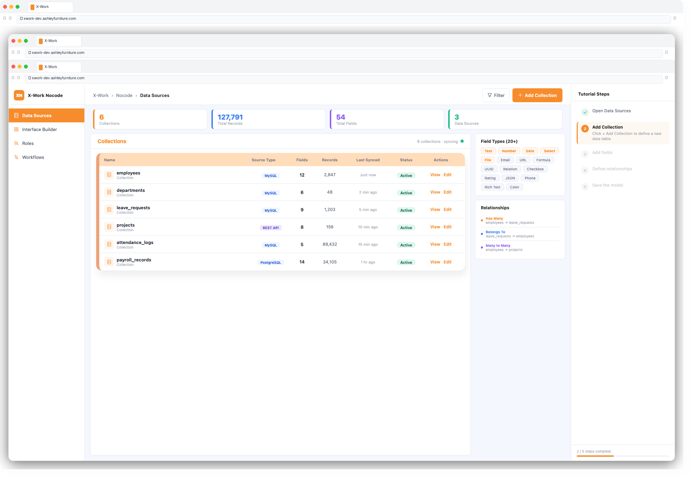
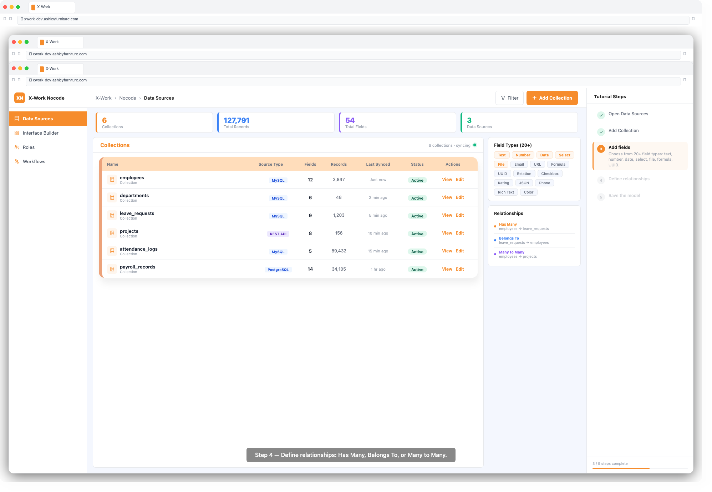

# X-Work — User Guide: Data Sources

## Overview

The Data Sources module is the foundation of every X-Work application. It lets you connect to databases or external APIs, define the shape of your data (collections and fields), and set up relationships between data entities — all without writing SQL or code.

---

## Key Concepts

| Term | Meaning |
|------|---------|
| **Data Source** | A connection to a database, API, or data system |
| **Collection** | A table or resource within a data source (equivalent to a database table) |
| **Field** | A column within a collection, with a defined type and rules |
| **Relationship** | A link between two collections (e.g. Orders → Customers) |

---

## Step 1: Access Data Sources

1. Log in to X-Work
2. In the left navigation, click **Settings** → **Data Sources**
3. You will see a list of existing data sources (the main database is pre-configured)

---

## Step 2: Connect a New Data Source

### Option A — Main Database (MySQL)
The default X-Work database is connected automatically. You can create collections directly without additional setup.

### Option B — External Database
1. Click **+ Add Data Source**
2. Select the source type (e.g. MySQL, PostgreSQL)
3. Enter connection details: Host, Port, Database Name, Username, Password
4. Click **Test Connection** to verify
5. Click **Save**

### Option C — REST API
1. Click **+ Add Data Source**
2. Select **REST API**
3. Enter the base URL and authentication details (API key, Bearer token, or OAuth)
4. Define the resource endpoints
5. Click **Save**

---

## Step 3: Create a Collection

1. Select your data source from the list
2. Click **+ Add Collection**
3. Enter a **Collection Name** (e.g. `projects`, `employees`)
4. Click **Confirm**

> **Tip:** Collection names use lowercase letters and underscores (e.g. `leave_requests`).

---

## Step 4: Add Fields

1. Open the collection and click **+ Add Field**
2. Select a **Field Type** from the dropdown:

| Field Type | Use Case |
|------------|---------|
| Single Line Text | Short text values (name, title) |
| Long Text | Multi-line descriptions |
| Number | Integer or decimal values |
| Percentage | Numeric values displayed as % |
| Date & Time | Timestamps with optional time |
| Checkbox | Boolean true/false |
| Select | Single choice from a list |
| Multi-Select | Multiple choices |
| File | File uploads |
| Image | Image uploads |
| Email | Email address |
| URL | Web links |
| JSON | Structured JSON data |
| Formula | Computed value from other fields |
| Auto-increment | Automatically incrementing number |
| UUID | Globally unique identifier |

3. Configure field properties:
   - **Required**: whether this field must be filled in
   - **Default value**: pre-fill when creating a record
   - **Unique**: ensure no duplicate values
4. Click **OK** to save the field

---

## Step 5: Define Relationships

1. Click **+ Add Field** and select a relationship type:

| Relationship | Meaning | Example |
|-------------|---------|---------|
| Has Many | One record has many related records | Department → Employees |
| Belongs To | This record belongs to one parent | Employee → Department |
| Has One | One record has exactly one related record | User → Profile |
| Many to Many | Both sides can have many of each other | Products ↔ Orders |

2. Select the **Target Collection** (the other side of the relationship)
3. Configure the **Foreign Key** field name
4. Click **OK**

---

## Step 6: Sync Data (Optional)

If you need to synchronize data from an external source on a schedule:

1. Navigate to **Settings** → **Data Sync**
2. Click **+ New Sync Task**
3. Select source and target collections
4. Configure the sync schedule (one-time or recurring cron)
5. Map fields between source and target
6. Click **Start Sync**

---

## Tips & Best Practices

- **Plan your data model first** — sketch out collections and relationships on paper before building in X-Work
- **Use descriptive field names** — `customer_name` is clearer than `name` when you have multiple collections
- **Set required fields** — prevents incomplete records from being submitted
- **Use relationships instead of duplicating data** — link Employee to Department rather than storing department name on every employee record
- **Test your connection** before saving an external data source to catch network or credential issues early

---

## Troubleshooting

| Issue | Solution |
|-------|---------|
| Connection test fails | Check host/port accessibility; verify credentials |
| Field not appearing in forms | Ensure the field is not set to hidden in the collection settings |
| Relationship not showing data | Verify the foreign key field is correctly mapped |
| Sync task not running | Check the cron schedule and confirm the task is enabled |
