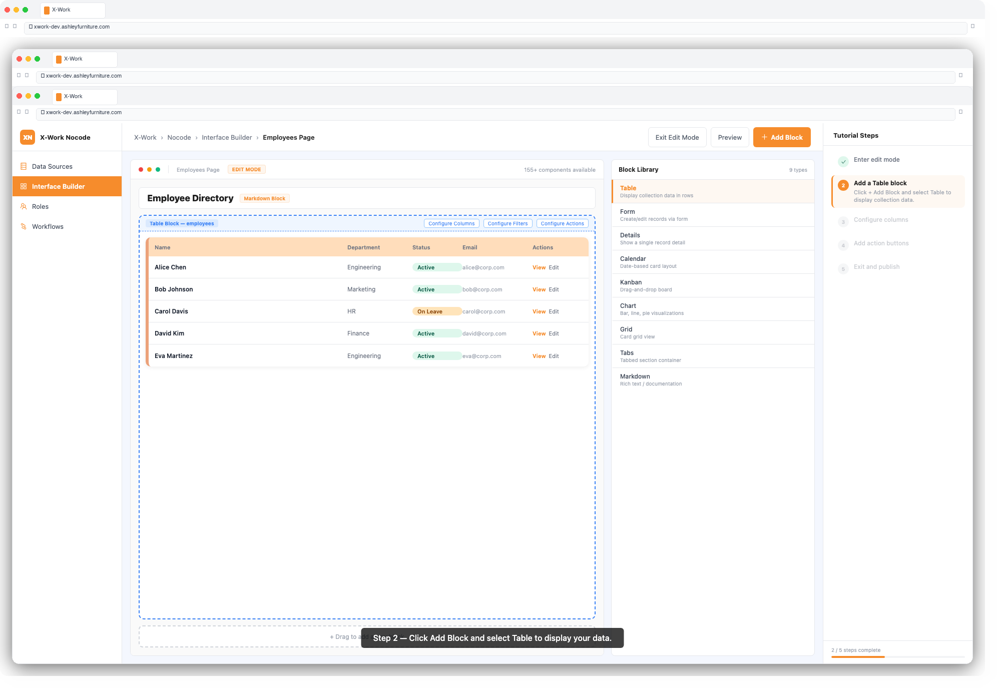
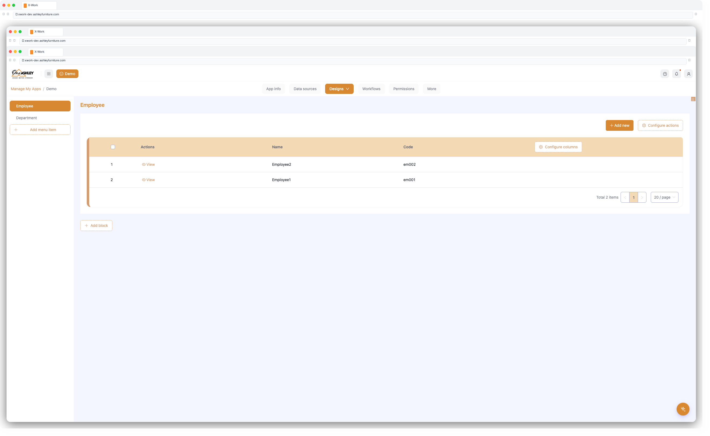
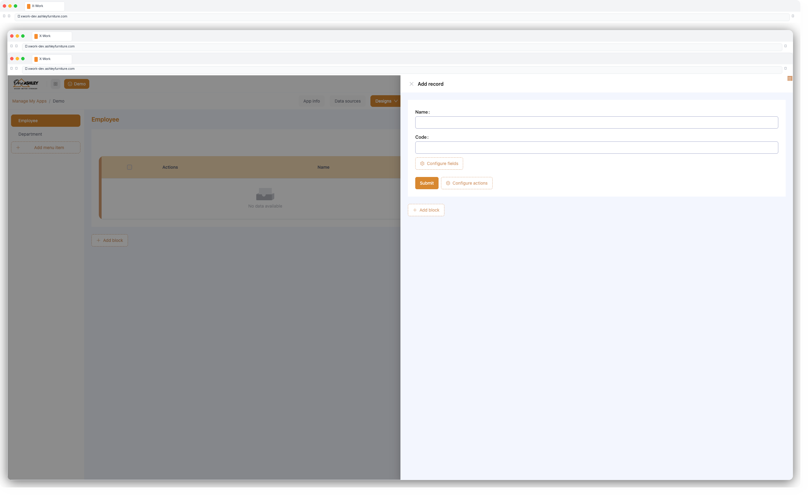
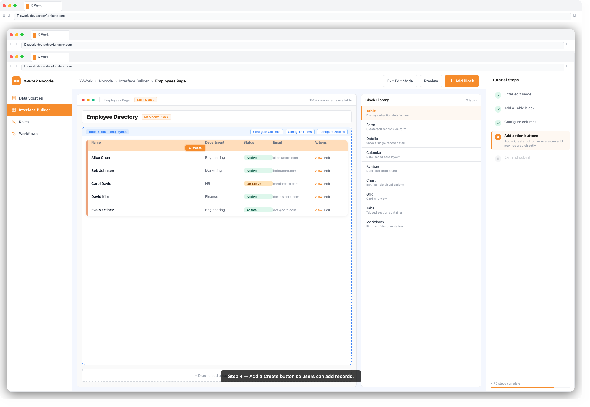

# X-Work — User Guide: Interface Builder

## Overview

The Interface Builder lets you design fully custom application screens using a visual, block-based editor. No frontend coding is required. You drag blocks onto a page canvas, bind them to your data, configure how they look and behave, and publish — your team sees the result immediately.

---

## Key Concepts

| Term | Meaning |
|------|---------|
| **Page** | A screen in your application, accessed via a route/URL |
| **Block** | A self-contained UI component placed on a page (table, form, chart, etc.) |
| **Action** | A button or trigger that performs an operation (save, delete, export, etc.) |
| **Schema** | The structured definition of a page and its blocks, stored in the database |
| **Template** | A reusable block or page layout that can be applied across multiple pages |

---

## Step 1: Create a Page

1. In the left navigation, click **+** next to **Pages** (or open the page management panel)
2. Click **Add Page**
3. Enter a **Page Title** and optionally set a URL path
4. Click **Confirm**
5. The page opens in **Edit Mode** (indicated by the pencil icon in the top-right)

---

## Step 2: Add a Block to the Page

1. With Edit Mode active, click **+ Add Block** in the center of the canvas or at the top of the page
2. A block picker panel appears — choose from:

### Block Types

| Block | Best For |
|-------|---------|
| **Table** | Displaying lists of records with sorting, filtering, pagination |
| **Form** | Entering or editing a single record |
| **Details** | Viewing a single record read-only |
| **Calendar** | Displaying date-based records on a calendar |
| **Kanban** | Visualizing records by status/category in columns |
| **Gantt** | Project timeline visualization |
| **Map** | Geolocation data display |
| **Chart** | Bar, line, pie, and other data visualizations |
| **Grid** | Layout container for arranging other blocks side-by-side |
| **Tabs** | Tabbed layout container |
| **Markdown** | Static rich-text content |

3. After selecting a block type, choose the **Collection** (data source) it connects to
4. Click **Confirm** — the block appears on the canvas

---

## Step 3: Configure a Table Block

1. Hover over the block and click the **settings icon** (gear/wrench) in the top-right corner of the block
2. **Configure Columns:**
   - Click **Configure Columns**
   - Toggle fields on/off to show or hide them
   - Drag fields to reorder columns
3. **Configure Filters:**
   - Click **Configure Filters**
   - Add filter conditions (e.g. `Status = Active`)
   - Set filter visibility: always applied vs. user-selectable
4. **Configure Sorting:**
   - Set a default sort field and direction
5. **Set Page Size:**
   - Choose how many records appear per page (10, 20, 50, etc.)

---

## Step 4: Configure a Form Block

1. Open block settings → **Configure Fields**
2. Toggle fields on/off, drag to reorder
3. Set field display options:
   - **Label**: rename how the field appears in the form
   - **Required**: mark fields mandatory
   - **Default value**: pre-populate on open
   - **Read-only**: display but disallow editing
4. Configure **Form Layout**: single-column, two-column, or custom grid

---

## Step 5: Add Actions

Actions are buttons that appear in blocks (table toolbar, form footer, or detail view).

1. Open block settings → **Configure Actions**
2. Click **+ Add Action** and choose an action type:

| Action | What It Does |
|--------|-------------|
| **Create** | Opens a form to add a new record |
| **Edit** | Opens a form to edit the selected record |
| **Delete** | Deletes the selected record (with confirmation) |
| **Save** | Saves a form submission |
| **Submit** | Submits the form (triggers workflow if connected) |
| **Export** | Exports table data to Excel/CSV |
| **Import** | Imports records from Excel/CSV |
| **Bulk Edit** | Edit multiple selected records at once |
| **Bulk Delete** | Delete multiple selected records at once |
| **Print** | Prints the current view |
| **Custom Request** | Calls a custom API endpoint |
| **Open Popup** | Opens a drawer/dialog with another block inside |
| **Trigger Workflow** | Manually starts a connected workflow |

3. Configure each action:
   - **Label**: rename the button text
   - **Type**: choose button style (primary, default, danger)
   - **Condition**: show/hide based on record state or user role
4. Drag actions to reorder them in the toolbar

---

## Step 6: Use Tabs and Grid Layout

**Grid (side-by-side blocks):**
1. Add a **Grid** block to the page
2. Click inside the grid to add sub-blocks into each column
3. Drag the column divider to adjust widths

**Tabs:**
1. Add a **Tabs** block to the page
2. Click **+ Add Tab** and name each tab
3. Add blocks inside each tab panel independently

---

## Step 7: Save and Use Templates

To save a block as a reusable template:
1. Hover over the block → open settings → **Save as Template**
2. Enter a template name and category
3. Click **Save**

To apply a saved template:
1. Click **+ Add Block** → **From Template**
2. Select the template from the library
3. Click **Confirm**

---

## Step 8: Preview and Publish

1. Click the **Preview** button (eye icon) to see how the page looks to end users
2. When satisfied, click **Exit Edit Mode** — changes are saved and live immediately
3. Share the page URL with your team

---

## Tips & Best Practices

- **Start with a Table block** for most use cases — it's the fastest way to see and manage your data
- **Use Tabs** to group related blocks on a single page without overcrowding
- **Set permissions** on pages and actions using the Users & Permissions module to control who sees what
- **Use Templates** for repeated layouts (e.g. a standard detail view) to save configuration time
- **Test actions** in preview mode before sharing with your team

---

## Troubleshooting

| Issue | Solution |
|-------|---------|
| Block shows no data | Check the collection binding and ensure the data source has records |
| Action button missing | Confirm the action is toggled on in Configure Actions |
| Column not showing | Check Configure Columns — the field may be toggled off |
| Form field not editable | The field may be set to Read-only; check field settings |
| Page not loading | Verify the page route and user role has access to this page |
