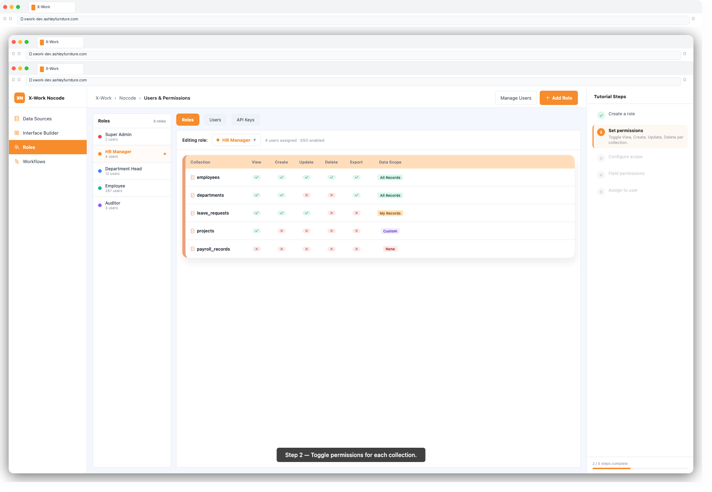
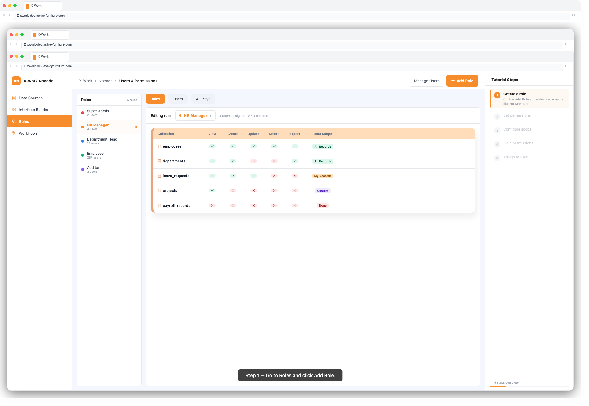

# X-Work — User Guide: Users & Permissions

## Overview

The Users & Permissions module gives administrators precise control over who can access what in X-Work. Using Role-Based Access Control (RBAC), you define roles with specific resource permissions, then assign those roles to users. This ensures every team member sees exactly what they need — and nothing more.

---

## Key Concepts

| Term | Meaning |
|------|---------|
| **User** | An individual with a login account in X-Work |
| **Role** | A named set of permissions (e.g. "Manager", "Read-Only Viewer") |
| **Resource** | A collection, page, or system feature that can be accessed |
| **Action** | An operation on a resource (read, create, update, delete) |
| **Scope** | A data filter that limits which records a role can see/edit |
| **Field Permission** | Control visibility of specific fields within a collection |

---

## Step 1: Access Users & Permissions

1. Log in with an administrator account
2. Navigate to **Settings** → **Users & Permissions**
3. You will see two tabs: **Users** and **Roles**

---

## Step 2: Manage Users

### View All Users
1. Click the **Users** tab
2. The list shows all registered users with their roles and status

### Invite / Add a User
1. Click **+ Invite User**
2. Enter the user's **email address**
3. Select one or more **roles** to assign
4. Click **Send Invitation** — the user receives an email with a login link

### Edit a User
1. Click a user's name in the list
2. Update their name, email, or role assignments
3. Click **Save**

### Deactivate a User
1. Click a user's name
2. Toggle **Status** to **Disabled**
3. Click **Save** — the user can no longer log in but their data is retained

---

## Step 3: Create a Role

1. Click the **Roles** tab
2. Click **+ Add Role**
3. Enter a **Role Name** (e.g. `HR Manager`, `Read Only`, `Finance Team`)
4. Optionally add a description
5. Click **Confirm**

---

## Step 4: Configure Role Permissions

1. Click the role name to open its permission configuration
2. You will see a list of all collections and system resources

### Setting Collection Permissions

For each collection, you can enable or disable the following actions:

| Action | Description |
|--------|-------------|
| **View** | Read records in this collection |
| **Create** | Add new records |
| **Update** | Edit existing records |
| **Delete** | Remove records |
| **Export** | Download data |
| **Import** | Upload data |

**To set permissions:**
1. Find the collection in the list
2. Toggle each action on or off
3. Click **Save**

---

### Setting Data Scope (Record-Level Filtering)

Data scope limits which records a role can see or edit, even if the action is permitted.

1. Next to an action (e.g. View), click **Scope**
2. Choose a scope option:
   - **All Records**: role can see every record in the collection
   - **My Records**: role can only see records they created (`Created By = current user`)
   - **My Department's Records**: role can see records from their department
   - **Custom Condition**: define a custom filter (e.g. `Status = Approved AND Region = Asia`)
3. Build the condition using the filter builder
4. Click **Save**

---

### Setting Field-Level Permissions

For sensitive fields, you can hide or make them read-only per role:

1. Next to a collection, click **Field Permissions**
2. A matrix shows all fields with columns for View and Edit
3. Toggle each field:
   - **View ✓, Edit ✓** — field is visible and editable
   - **View ✓, Edit ✗** — field is visible but read-only
   - **View ✗** — field is completely hidden from this role
4. Click **Save**

---

## Step 5: Configure Page Permissions

Control which roles can access which pages:

1. Navigate to **Settings** → **Menus**
2. Right-click a page or menu item → **Configure Permissions**
3. Select which roles can see this menu item / access this page
4. Click **Save**

---

## Step 6: Assign Roles to Users

1. Go to **Settings** → **Users & Permissions** → **Users**
2. Click a user's name
3. In the **Roles** field, click to add or remove roles
4. Click **Save**

> A user can have multiple roles. Their effective permissions are the **union** of all assigned roles.

---

## Step 7: Configure Authentication (Admin Only)

### Password Policy
1. Navigate to **Settings** → **Authentication** → **Password Policy**
2. Set minimum length, complexity requirements, and expiry period

### Single Sign-On (SSO)
1. Navigate to **Settings** → **Authentication** → **SSO**
2. Select the SSO provider (Azure Entra, SAML, CAS)
3. Enter the provider's configuration details (Tenant ID, Client ID, Client Secret)
4. Click **Enable** and **Save**

### Multi-Factor Authentication (MFA)
1. Navigate to **Settings** → **Authentication** → **MFA**
2. Toggle **Enable MFA** on
3. Select supported methods (Authenticator App, SMS)
4. Set whether MFA is required for all users or specific roles

---

## Step 8: API Keys

For system integrations that need programmatic access:

1. Navigate to **Settings** → **API Keys**
2. Click **+ Generate API Key**
3. Enter a name and set an expiry date
4. Copy and securely store the generated key (it is shown only once)
5. Assign a role to the API key to control its access level

---

## Built-in Roles

X-Work includes the following default roles:

| Role | Description |
|------|-------------|
| **Admin** | Full access to all settings, data, and configuration |
| **Member** | Standard access — can view and interact with permitted resources |
| **Read Only** | Can view data but cannot create, edit, or delete |

> You can modify or extend these roles, or create additional roles to match your organization.

---

## Tips & Best Practices

- **Follow the principle of least privilege** — grant only the minimum permissions needed for each role
- **Use data scope** instead of creating separate views — it's more maintainable
- **Group similar users into roles** rather than configuring permissions per individual
- **Audit regularly** — use the audit log (**Settings → Audit Logs**) to review who accessed or changed what
- **Disable rather than delete** deactivated users to preserve their data history

---

## Troubleshooting

| Issue | Solution |
|-------|---------|
| User cannot see a page | Check role's menu permission for that page |
| User can see records they shouldn't | Review the data scope setting for that role |
| Field not appearing in form | Check field-level permissions — View may be disabled |
| SSO login failing | Verify Tenant ID and Client Secret are correctly entered |
| API key returns 403 | Check the role assigned to the API key has the required action permissions |
