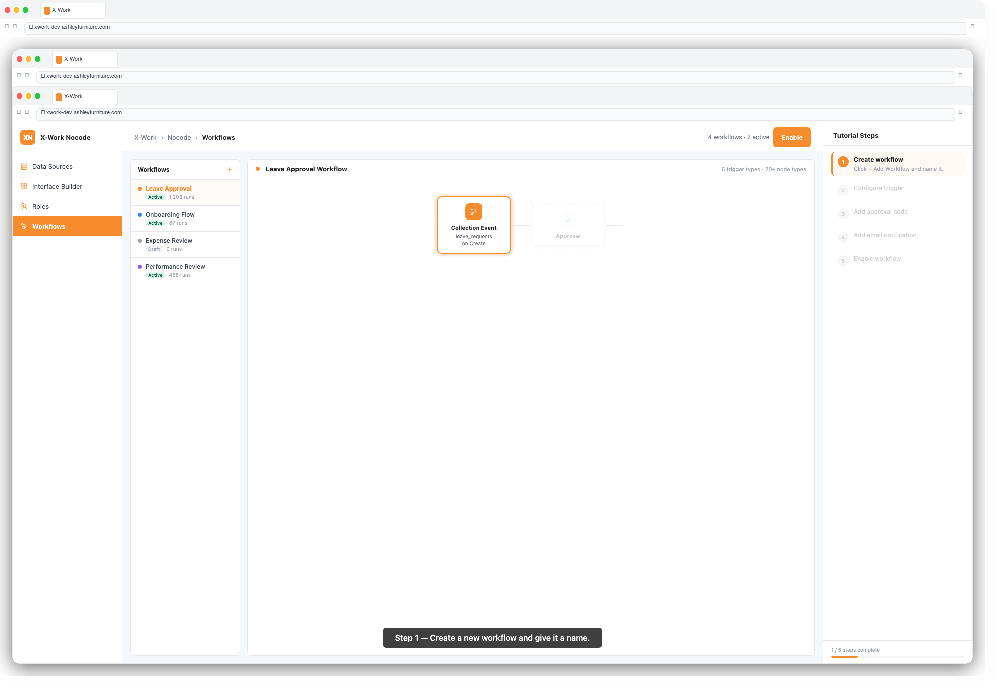
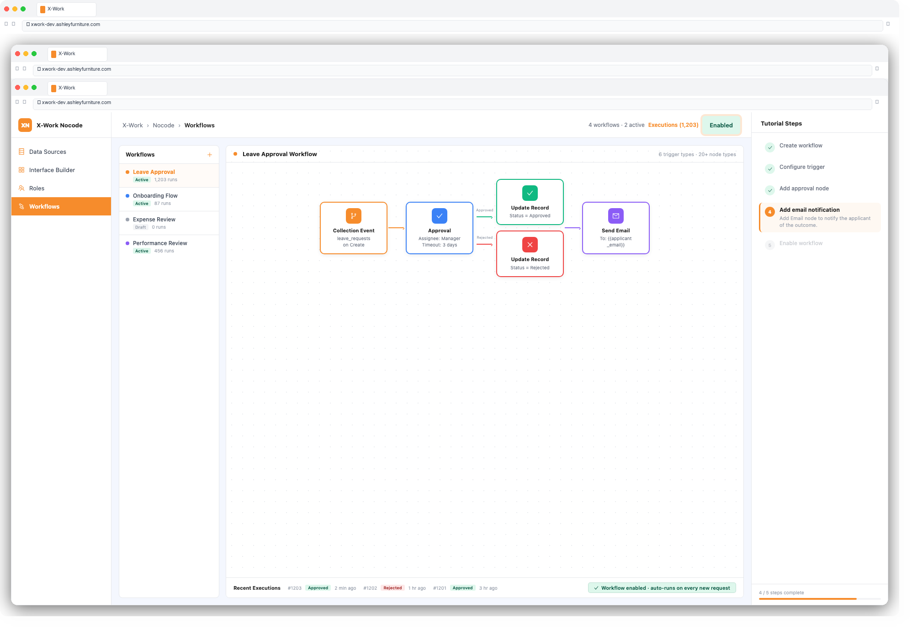

# X-Work — User Guide: Workflows

## Overview

The Workflows module lets you automate business processes visually — without writing code. Define what triggers a workflow, then chain together nodes (steps) that query data, update records, send emails, request approvals, call APIs, and more. Workflows run reliably in the background, freeing your team from manual, repetitive tasks.

---

## Key Concepts

| Term | Meaning |
|------|---------|
| **Workflow** | A reusable automation template consisting of a trigger and a sequence of nodes |
| **Trigger** | The event or condition that starts the workflow |
| **Node** | A single processing step within the workflow (e.g. query data, send email) |
| **Execution** | One instance of a workflow running from start to finish |
| **Job** | The result of a single node within an execution |
| **Variable** | A named value that carries data between nodes |

---

## Step 1: Access Workflows

1. Log in to X-Work
2. In the left navigation, click **Workflows**
3. You will see a list of existing workflows with their status and last execution time

---

## Step 2: Create a New Workflow

1. Click **+ Add Workflow**
2. Enter a **Workflow Name** (e.g. `Leave Request Approval`, `Daily Report Email`)
3. Click **Confirm** — the workflow canvas opens

---

## Step 3: Configure the Trigger

The trigger defines when the workflow starts. Click the **Trigger** node at the top of the canvas to configure it.

### Trigger Types

| Trigger | When It Fires |
|---------|--------------|
| **Collection Event** | When a record is created, updated, or deleted in a collection |
| **Schedule** | At a fixed time or recurring interval (cron-based) |
| **Manual** | When a user clicks a "Trigger Workflow" button in the UI |
| **Page Load** | When a specific page is loaded in the application |
| **Request Interception** | Before an API request completes (allows modification or rejection) |
| **External AI Invocation** | When an AI tool calls this workflow via MCP |

### Example: Collection Event Trigger
1. Select **Collection Event**
2. Choose the **Collection** (e.g. `leave_requests`)
3. Select the **Event**: Create, Update, or Delete
4. Optionally set a **Pre-conditions** filter (e.g. only fire when `Status = Pending`)
5. Click **Save**

### Example: Schedule Trigger
1. Select **Schedule**
2. Choose **Recurring** and enter a cron expression (e.g. `0 9 * * 1` = every Monday at 9am)
   — or choose **Fixed date/time** for a one-off execution
3. Click **Save**

---

## Step 4: Add Nodes

Click the **+** button below any node on the canvas to add the next step.

### Node Categories

#### Data Nodes
| Node | What It Does |
|------|-------------|
| **Query Collection** | Fetch one or multiple records with filters |
| **Create Record** | Add a new record to a collection |
| **Update Record** | Modify fields on existing records |
| **Delete Record** | Remove records from a collection |
| **SQL** | Execute a raw SQL query |

#### Logic Nodes
| Node | What It Does |
|------|-------------|
| **Condition** | Branch the workflow: if X then path A, else path B |
| **Loop** | Repeat a set of nodes for each item in a list |
| **Delay** | Pause execution for a defined duration |
| **Jump** | Skip forward or backward in the workflow |

#### Integration Nodes
| Node | What It Does |
|------|-------------|
| **HTTP Request** | Call any external REST API |
| **JavaScript** | Run custom logic with a code snippet |
| **Sub-Workflow** | Call another workflow and receive its result |
| **MCP Tool** | Invoke an AI tool and use its response |

#### People Nodes
| Node | What It Does |
|------|-------------|
| **Approval** | Route to one or more approvers; pause until they respond |
| **Manual Task** | Assign a task to a user and pause until they complete it |
| **Email** | Send an email with dynamic content |
| **Task Notification** | Post an in-app notification/task to a user |

#### File Nodes
| Node | What It Does |
|------|-------------|
| **File Converter** | Convert files between formats (e.g. docx → pdf) |



---

## Step 5: Configure a Node

1. Click a node on the canvas to open its configuration panel on the right
2. Fill in the required fields — each node type has its own settings:

### Example: Query Collection Node
- **Collection**: select the table to query (e.g. `employees`)
- **Filter**: add conditions (e.g. `Department = {{trigger.department_id}}`)
- **Sort**: choose sort field and direction
- **Limit**: max number of records to return

### Example: Approval Node
- **Assignees**: choose users or roles who must approve
- **Mode**: Any one approver / All must approve / Percentage threshold
- **Timeout**: optionally auto-reject or auto-approve after a time limit
- **On Approve / On Reject**: connect different next steps for each outcome

### Example: Email Node
- **To**: enter email addresses or use a variable (e.g. `{{trigger.applicant_email}}`)
- **Subject**: static text or dynamic with variables
- **Body**: rich-text editor with variable placeholders

---

## Step 6: Use Variables

Variables let you pass data between nodes throughout the workflow.

### Variable Sources
- **Trigger variables**: data from the triggering event (e.g. `{{trigger.record.id}}`)
- **Node output variables**: results from previous nodes (e.g. `{{query_node.results[0].name}}`)
- **System variables**: current time, current user, etc.

### Using Variables in Node Configuration
1. In any text field, type `{{` to open the variable picker
2. Browse or search for the variable you need
3. Click to insert — it appears as `{{node_name.field_name}}`

---

## Step 7: Add Conditional Branching

1. Click **+** → **Condition**
2. In the condition node settings, define the branch condition:
   - Select a variable
   - Choose a comparator (equals, contains, greater than, is empty, etc.)
   - Enter a value
3. The canvas shows two branches: **Yes** (condition met) and **No** (condition not met)
4. Add different nodes to each branch

You can nest multiple conditions for complex routing.

---

## Step 8: Enable and Test the Workflow

1. When your workflow is configured, click **Enable** (toggle in the top-right of the canvas)
2. To test manually: go to the **Executions** tab and click **Run Manually**
3. Monitor the result in **Executions** — click any execution to see each node's job result and output data

---

## Step 9: Monitor Executions

1. Click the **Executions** tab on the workflow
2. Each row shows an execution with status: **Running**, **Resolved**, **Failed**, **Pending**
3. Click an execution to see a step-by-step visualization of the run
4. Click any job (node step) to see its input, output, and any errors



---

## Common Workflow Examples

### Example 1: Leave Request Approval
```
Trigger: Collection Event → leave_requests (on Create)
→ Send Email: notify manager
→ Approval: manager must approve or reject
  → [Approved] Update Record: set Status = Approved
  → [Rejected] Update Record: set Status = Rejected
→ Send Email: notify employee of result
```

### Example 2: Daily Report Generation
```
Trigger: Schedule → every day at 8:00 AM
→ Query Collection: fetch yesterday's completed tasks
→ JavaScript: calculate summary statistics
→ Email: send report to team leads
```

### Example 3: New Employee Onboarding
```
Trigger: Collection Event → employees (on Create)
→ Create Record: generate IT access request
→ Manual Task: IT team assigns equipment
→ Email: welcome email to new employee
→ Task Notification: notify HR to schedule orientation
```

---

## Tips & Best Practices

- **Name nodes clearly** — good names like "Fetch Pending Requests" are easier to debug than "Query 1"
- **Use pre-conditions on triggers** to avoid unnecessary executions
- **Test with real data** — use "Run Manually" with an actual record ID when possible
- **Keep workflows focused** — one workflow per business process; use Sub-Workflow for shared logic
- **Handle failures** — add a Condition after critical nodes to route errors to a notification or fallback path

---

## Troubleshooting

| Issue | Solution |
|-------|---------|
| Workflow not triggering | Check it is Enabled; verify trigger conditions match your test case |
| Node showing "Failed" | Click the job in Executions to see the error message and input data |
| Variable showing empty | Verify the source node succeeded and the variable path is correct |
| Approval never resolving | Check if approver received the notification; verify assignee configuration |
| Schedule not firing | Verify cron expression is correct (use a cron parser tool to validate) |
