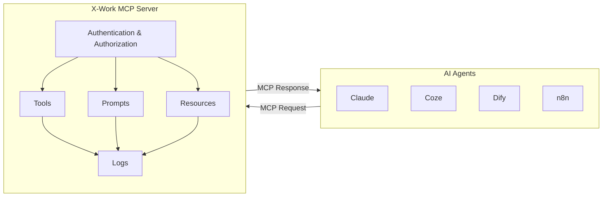
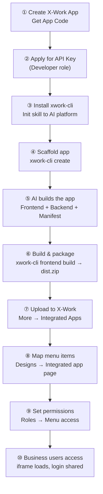

# X-Work Open Capabilities — Product Overview

## What Is X-Work Open Capabilities?

X-Work Open Capabilities is a set of platform extensions that opens X-Work — Ashley's internal no-code platform — to the AI ecosystem. It lets teams expose X-Work data and business logic through standard protocols, turn any X-Work app into an AI-callable service, and ship AI-generated applications directly into the X-Work environment — all without writing integration code from scratch.

**Three capabilities. One open platform.**

---

## Background: Why Now?

X-Work is Ashley's internal no-code platform, powering core business systems including APS, Customer Complaints, and more. As the volume and diversity of business applications on X-Work grows, two structural gaps have emerged:

**Gap 1 — Closed data silos.** X-Work holds valuable business data, but accessing it from external systems, reporting tools, or AI agents has always required one-off, hard-coded workarounds. There is no standard, secure, and reusable mechanism for an external system to read or write X-Work data.

**Gap 2 — No AI-native integration path.** AI vibe-coding tools (Claude, Cursor, Augment, Copilot) can now generate fully functional business applications from a natural-language prompt. But X-Work has no official mechanism to receive, host, and route these AI-produced applications into its navigation and authentication system. Every AI-generated app either lives outside X-Work or requires manual, bespoke integration work.

X-Work Open Capabilities resolves both gaps simultaneously, with three purpose-built modules:

| Gap | Module | How It's Solved |
|---|---|---|
| External systems can't access X-Work data safely | **Open API** | Standard REST API with role-bound, expirable API Keys |
| AI agents need callable X-Work business tools | **MCP Service** | No-code MCP server builder — expose any X-Work app as an AI tool set |
| AI-built apps have no path into X-Work | **X-Work Integration** | Upload-and-run: AI-generated app packages hosted, routed, and authenticated by X-Work |

---

## Module 1 — Open API

### What It Is

X-Work now exposes all platform data and business logic as standard REST APIs. Any external system, automation pipeline, or AI agent can call these APIs using an API Key — with permissions governed entirely by the X-Work role that key is bound to.

All endpoints follow a unified Resource-Action pattern:

```
/api/{resource}:{action}
```

### Capabilities

#### Data Read & Write (CRUD)

External systems can perform full create, read, update, and delete operations on any authorized X-Work Collection.

| Operation | Endpoint |
|---|---|
| List records | `GET /api/{resource}:list` |
| Get one record | `GET /api/{resource}:get?filterByTk={id}` |
| Create | `POST /api/{resource}:create` |
| Update | `POST /api/{resource}:update?filterByTk={id}` |
| Delete | `POST /api/{resource}:destroy?filterByTk={id}` |

Query support includes: condition filtering (12 operators: `$eq`, `$ne`, `$gt`, `$in`, `$like`, `$and`, `$or`, etc.), multi-field sorting, pagination, field selection, and relation appending.

#### Workflow Trigger & Tracking

External events can initiate X-Work business workflows and track their execution in real time.

- Trigger a workflow: `POST /api/workflows:execute`
- Query execution status: `GET /api/executions:get`
- Submit an approval decision: `POST /api/approval_jobs:submit`

This enables scenarios like: an external system detects an order anomaly → triggers an X-Work review workflow → submits an approval decision → reads the outcome.

#### API Key Management

API Keys are created in **X-Work Console → Settings → API Keys**:

- Each key is bound to a X-Work role at creation time — the role determines the key's exact permission scope
- Configurable expiration: 7 days / 30 days / 90 days / 1 year / never expires
- Keys are shown only once — copy at creation; deletion takes effect immediately

### User Stories

| Role | Story |
|---|---|
| Integration Engineer | As an integration engineer, I create an API Key bound to a X-Work role and immediately start querying any authorized Collection with standard REST calls — no custom bridge code, no platform changes required. |
| Automation Engineer | As an automation engineer, I trigger a X-Work Workflow from an external event via `POST /api/workflows:execute`, then poll the execution status and programmatically submit approval decisions — all without touching the X-Work UI. |
| AI Developer | As an AI developer, I give my AI agent a role-bound API Key so it can read and write X-Work business data within a defined permission boundary — without exposing the entire platform. |
| Data Analyst | As a data analyst, I pull live X-Work Collection data into my BI tool or reporting pipeline using `GET /api/{resource}:list` with filters and pagination — no manual CSV export needed. |
| Platform Administrator | As a platform administrator, I create API Keys with configurable expiration and delete them instantly when no longer needed — access is revoked immediately, with no residual risk. |

### Who Benefits

| Audience | How They Use Open API |
|---|---|
| Integration engineers | Connect internal tools, dashboards, and reporting systems to X-Work data |
| Automation teams | Trigger X-Work workflows from external events (webhooks, scheduled jobs) |
| AI developers | Give AI agents structured read/write access to X-Work business data |
| Data analysts | Pull X-Work data into BI tools or data pipelines without manual export |

### What Changes for Users

Before Open API, connecting anything to X-Work required a developer to build a custom, non-standard bridge that only worked for one specific use case. Now, any authorized system can connect to X-Work with a single API Key and standard HTTP calls — in minutes.

---

## Module 2 — MCP Service

### What It Is

MCP (Model Context Protocol) is the emerging standard protocol that lets AI agents (large language models) call external tools and data sources in a structured, authenticated way. X-Work MCP Service lets administrators expose any X-Work application as an MCP server — through a no-code visual interface inside X-Work itself, without writing any server code.

Once enabled, AI agents like Claude, Coze, Dify, and n8n can discover and invoke X-Work business logic as MCP Tools directly in conversation.

### Architecture



### Capabilities

#### MCP Server Management

- Each X-Work application gets its own unique MCP Server endpoint URL
- Enable or disable the MCP service per application with one click
- Edit service metadata: name, description, icon, website URL, version — as shown to MCP clients

#### Authentication (Two Modes)

**App Bearer Token** — For machine-to-machine integration (automation agents, pipelines):
- Create a static bearer token per calling application
- Bind the token to one or more X-Work roles (determines tool access)
- Set expiration; update or revoke at any time

**User OAuth (Authorization Code Flow)** — For user-facing AI assistants:
- Create an OAuth client with a redirect URL
- Users authenticate individually; the MCP server serves resources based on that user's X-Work role
- Configuration available in v1; end-to-end flow finalizing

#### No-Code Tool Builder

The core of MCP Service is a visual tool builder. Each MCP Tool is configured on a workflow-like canvas:

1. **Trigger** — Define the tool's input schema using a JSONSchema editor. Properties can be: string, number, array, object, boolean, integer, single-select, multi-select. Mark fields as required and add descriptions that guide the LLM on how to call the tool.

2. **Workflow nodes** — Connect synchronous processing steps between the trigger and the response. Standard X-Work workflow nodes are available; human-in-the-loop nodes (approval, audit) are not supported (MCP tools are synchronous).

3. **MCP Tool Response** — Define what the tool returns to the calling agent:
   - On success: one or more text content cards, with variable references to workflow outputs
   - On business failure: a structured error response with `isError: true`
   - The response conforms to MCP protocol: both `content` (for LLM reading) and `structuredContent` (for programmatic parsing) are returned

Tools can be tested with **Execute Manually** — directly invoke the tool logic from the canvas, without going through MCP protocol or authentication, to verify correctness before connecting a client.

#### MCP Access Control (RBAC)

Fine-grained per-role tool access under **Permissions → Roles → MCP Access Control**:

| Access Scope | Behavior |
|---|---|
| No access (default for new roles) | Role cannot see or call any tools |
| Full access | Role can access all tools |
| Partial access | Role can only access the explicitly selected tools |

Owner and Manager roles default to Full access and cannot be restricted.

#### Logs

Every MCP client request and server response is logged — request time, invoker (App or User), method, target tool/prompt/resource, and response status. Click any entry to see the full request/response payload, useful for security audits and debugging.

#### Connection (Example — Claude Desktop)

```json
{
  "mcpServers": {
    "my-xwork-app": {
      "url": "https://xworkdev.ashgso.com/mcp/my-app",
      "headers": {
        "x-app-authorization": "YOUR_BEARER_TOKEN"
      }
    }
  }
}
```

### User Stories

| Role | Story |
|---|---|
| Platform Administrator | As a platform administrator, I enable MCP Service on an existing X-Work app with one click — the platform generates a unique MCP Server endpoint instantly, with no server code to write. |
| Platform Administrator | As a platform administrator, I create a no-code MCP Tool on the visual canvas, define its input schema with the JSONSchema editor, connect it to X-Work workflow nodes, and configure what it returns — all without touching code. |
| Platform Administrator | As a platform administrator, I create an App Bearer Token for a specific AI agent, bind it to a X-Work role, and set its expiration — the agent gets exactly the tool access its role permits, nothing more. |
| AI Agent Developer | As an AI agent developer, I paste the MCP Server URL and Bearer Token into my agent's config (Claude Desktop, Coze, Dify, n8n) and my agent immediately discovers and can call all enabled X-Work tools. |
| Business User | As a business user, I interact with an AI assistant that calls X-Work MCP tools on my behalf — submitting forms, querying records, triggering approvals — without me needing to open X-Work directly. |
| IT / Security Auditor | As a security auditor, I review MCP Logs to see every AI-to-X-Work request: who called what tool, when, and what the result was — full traceability with no extra instrumentation needed. |

### Who Benefits

| Audience | How They Use MCP Service |
|---|---|
| Platform administrators | Expose X-Work business logic as AI-callable tools without writing server code |
| AI agent developers | Connect AI workflows (Claude, Coze, Dify, n8n) to live X-Work data and processes |
| Business teams | Enable AI assistants to take real actions inside X-Work on behalf of users |
| IT / Security teams | Audit every AI-to-X-Work interaction through the built-in logs |

### What Changes for Users

Before MCP Service, making X-Work callable by an AI agent required a developer to build a custom MCP server from scratch — typically days of work. Now, a platform administrator can expose any X-Work app as an AI tool set in minutes, entirely through the X-Work UI. The AI ecosystem treats X-Work as a first-class service.

---

## Module 3 — X-Work Integration

### What It Is

X-Work Integration enables the platform to host and render embedded applications built by AI coding assistants. It consists of two parts that work together:

1. **Platform-side**: New infrastructure in X-Work Console for uploading, parsing, and managing application packages, plus a new page type ("Integrated app page") in the page editor for binding app routes to X-Work's sidebar navigation.

2. **Developer-side**: The `xwork-integration` skill — a comprehensive AI coding context skill and CLI (`xwork-cli`) that guides AI assistants through the full development lifecycle, from empty project to production-ready `dist.zip`.

### The Goal

> **A business analyst who knows how to use Claude or Cursor can build, package, and deploy a fully functional X-Work business application in half a day.**

### User Stories

| Role | Story |
|---|---|
| AI Developer (App Author) | As an AI developer, I run the skill's scaffold command to get a standard project skeleton that conforms to the platform contract. I then let AI continue vibe-coding within the skill's constraints — zero setup barrier from scratch. |
| Platform Administrator | As a platform administrator, I upload a `<code>-<version>.zip` on the Integrated Apps management page. The platform parses `xwork.manifest.json` and displays the declared route list (`routes[]`) — I can see exactly what pages the app exposes. |
| Administrator | As an administrator, when creating a new page in the page editor, I can select the page type "Integrated app page" and map it to a specific app route (by choosing App + Route). Opening that page is equivalent to opening the corresponding app page. |
| Business User | As a business user, I access X-Work pages normally. When a page type is "Integrated app page," I see the app content seamlessly — login state is shared automatically, and ACL takes effect without any extra steps. |
| Platform Administrator | As a platform administrator, I can view all installed apps — their versions, route lists, and which "Integrated app pages" reference them — and upgrade or uninstall them. When uninstalling, the platform warns me if any routes are still referenced by menu items. |

### Authentication & Permissions — What You Don't Need to Build

Embedded apps automatically inherit X-Work's identity and permission system:

- **Login state automatically reused** — Integrated apps are deployed on the same domain as X-Work. The browser sends the X-Work session cookie automatically; embedded apps do not need to implement a separate login flow.
- **Permission system directly inherited** — Apps access data through an X-Work API Key bound to a user role. ACL is governed entirely by X-Work's role system — no separate user management or permission module needed.
- **Security boundary enforced by the platform** — All API requests pass through X-Work's authentication layer. The embedded app's data access is strictly limited to the permissions of its API Key's bound role, eliminating privilege escalation risk.

### Platform Capabilities — Integrated Apps

#### App Package Management (More → Integrated Apps)

| Feature | Description |
|---|---|
| Upload | Upload a `.zip` package; platform auto-reads `xwork.manifest.json` |
| Auto-parse | Extracts `code`, `version`, title, and `routes[]` from the manifest |
| List view | Shows all installed apps with code, version, route count, and active status |
| Detail view | Full app metadata, entry URL, route list (path / title / params) |
| Version management | Upload a new version to update an existing app |
| Delete with guard | Warns when the app is still referenced by menu items |

#### Menu ↔ Route Mapping (Designs → Add Menu Item)

Administrators bind X-Work sidebar menu items to application routes using a new page type: **Integrated app page**.

| Field | Description |
|---|---|
| Menu item title | Label shown in X-Work's left sidebar |
| App | The uploaded integrated app (shown as `<Title> (<code>@<version>)`) |
| Route | One route from the app's `routes[]`, selected from a dropdown |

Once saved, business users click the menu item and X-Work loads the app via iframe. Login state is shared automatically through the same-domain cookie — no re-authentication needed, no visible seam.

### Developer Capabilities — xwork-integration Skill

#### What the Skill Covers

| Area | Coverage |
|---|---|
| App scaffold | One-command project skeleton: frontend SPA, backend init script, `xwork.manifest.json` |
| Backend guidance | Collections, Fields, relationships (1:N, M:N), ACL role design, bootstrap script |
| Frontend guidance | SDK integration, X-Work REST API calls, 3-level ACL (page / action / field), Ant Design 5.x |
| Integration mode selection | Decision tree for 4 modes: same-domain iframe (default), same-domain plugin, cross-domain, server-to-server |
| AI Debug Preview | One command starts dev server + generates a session-authenticated preview link for AI verification |
| Build & self-check | 41-item automated validation before packaging — zero failures required to produce `dist.zip` |

#### 41-Item Self-Check (Selected Rules)

| Category | Example checks |
|---|---|
| Manifest | `xwork.manifest.json` exists; `code`, `version`, `routes[]` present and non-empty |
| API safety | No forbidden API calls; no absolute resource paths |
| Package structure | No `init/` directory in output; bundle size within limits |
| Iframe safety | No `window.top` navigation; no double-navigation patterns |

#### CLI Command Reference

| Task | Command |
|---|---|
| Install skill to AI platform | `xwork-cli init --ai <platform> --non-interactive` |
| Create new app | `xwork-cli create <app-name> --yes` |
| Start dev server + AI preview link | `xwork-cli dev` |
| Generate AI preview link only | `npm run ai:preview` |
| Create isolated test environment | `xwork-cli test create` |
| Check test environment health | `xwork-cli test health [app-name]` |
| Search skill knowledge base | `xwork-cli search "<query>" --domain <domain> --limit <n>` |
| List all entries in a domain | `xwork-cli search "" --domain <domain> --list` |
| Browse backend API catalog | `xwork-cli backend api [--category <type>]` |
| View field types | `xwork-cli backend field-types` |
| Initialize backend environment | `xwork-cli backend init` |
| Test backend connection | `xwork-cli backend test` |
| Apply declarative app plan | `xwork-cli apply` |
| Generate integration plan | `xwork-cli plan --mode <mode>` |
| Generate collection creation code | `xwork-cli generate collection <name>` |
| Validate project configuration | `xwork-cli validate` |
| Build + package (`dist.zip`) | `xwork-cli frontend build` |
| Uninstall skill | `xwork-cli uninstall --ai <platform> --yes` |

#### AI Platform Support (18 Platforms)

Claude · Cursor · Augment · Copilot · Windsurf · Codex · Continue · Gemini · Trae · OpenCode · Qoder · RooCode · KiloCode · Droid · Kiro · Warp · CodeBuddy · Agent

Install to all at once: `xwork-cli init --ai all`

#### The Development Flow



### Who Benefits

| Audience | How They Use X-Work Integration |
|---|---|
| AI developers / vibe-coders | Build full-stack X-Work apps using AI, with clear contracts and automated validation |
| Platform administrators | Accept and manage AI-produced apps with confidence; route them into X-Work's menu system |
| Business analysts | Describe a business need to an AI, get a working X-Work app without waiting for IT |
| IT teams | Every uploaded app goes through 41 automated checks before it reaches the platform |

### What Changes for Users

Before X-Work Integration, AI-generated apps lived outside X-Work or required manual developer effort to wire them in. Now, any AI-built application that passes the self-check can be uploaded, routed, and served through X-Work's navigation — with authentication and permissions applied automatically.

---

## Benefits Summary

| Benefit | Open API | MCP Service | X-Work Integration |
|---|---|---|---|
| Eliminates bespoke integration code | ✓ | ✓ | ✓ |
| Standard, documented protocol | REST | MCP | xwork.manifest.json |
| Role-based access control | ✓ | ✓ | ✓ |
| No new infrastructure to operate | ✓ | ✓ | ✓ |
| Works with existing X-Work apps | ✓ | ✓ | — |
| Supports 18+ AI platforms | — | ✓ (as client) | ✓ (as builder) |
| Enables non-developer delivery | — | Partial | ✓ |
