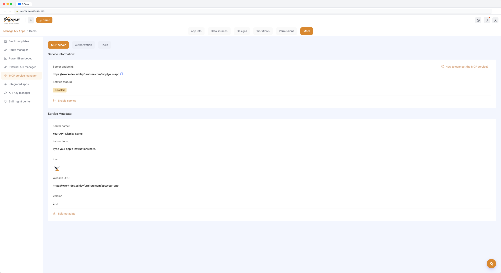
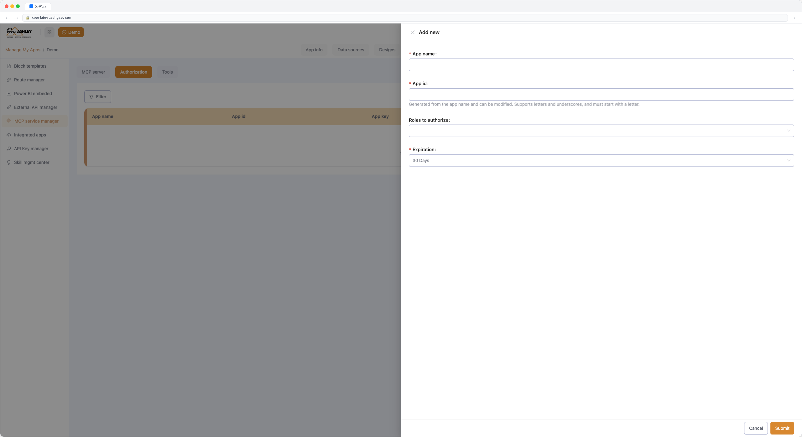
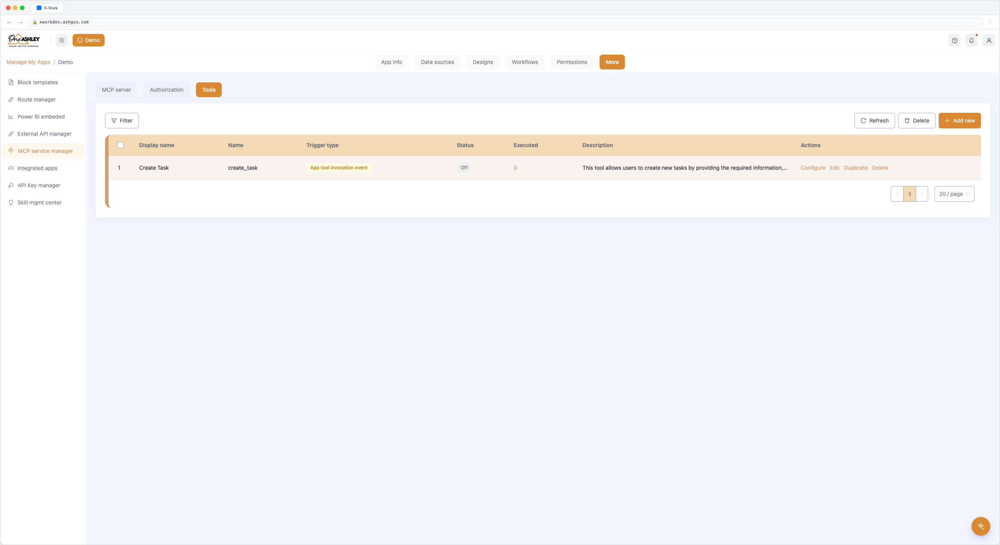

# MCP Service — User Guide

## Overview

X-Work MCP Service lets you expose any X-Work application as an MCP (Model Context Protocol) server — through a no-code visual interface. AI agents (Claude, Coze, Dify, n8n, and others) can then call your X-Work business logic as MCP Tools, Prompts, and Resources, with full authentication and role-based access control.

---

## Prerequisites

- You are a Platform Administrator or have Manager Permissions in the target X-Work app.
- The X-Work app you want to expose already exists with at least one collection or workflow.

---

## Step 1: Enable MCP Service for an App

1. Open the target X-Work application.
2. Navigate to **MCP Service Manager → MCP Server**.
3. Under **Service Information**, you will see:
   - **Server endpoint** — the unique MCP URL for this app. Click **Copy** to copy it.
   - **Service status** — defaults to `Disabled`.
4. Click **Enable service**. Confirm in the dialog. The service status changes to `Enabled`.

> To disable: click **Disable service** and confirm. All connected MCP clients will lose access immediately.



### How to Connect — Quick Reference

Click **How to connect to the MCP service?** to open the connection guide drawer. It provides:

- **URL**: same as the Server endpoint.
- **JSON Config**: a ready-to-paste config block for MCP clients.

```json
{
  "mcpServers": {
    "{Server name}": {
      "url": "https://xworkdev.ashgso.com/mcp/{app}",
      "headers": {
        "x-app-authorization": "YOUR APP KEY"
      }
    }
  }
}
```

Replace `YOUR APP KEY` with your Bearer token (see Step 2).

---

## Step 2: Configure Authorization

X-Work MCP supports two authentication modes. Choose one or both.

### Mode A: App Bearer Token Authentication

Best for: machine-to-machine integrations (agents, automation platforms).

1. Go to **MCP Server → Authorization → App bearer authentication**.
2. Click **Add new**.
3. Fill in:

| Field | Notes |
|---|---|
| App name | Human-readable name for this client |
| App id | Auto-filled from App name; letters and underscores only, must start with a letter |
| Roles to authorize | Select which X-Work roles this app inherits permissions from |
| Expiration | Default: 30 days. Options: 7 / 30 / 90 days, 1 year, never |

4. Click **Submit**. The Bearer token is generated — **copy it immediately**, it is shown only once.

**Managing existing apps:**
- **Update key**: Modify expiration only, or refresh the token and set a new expiration.
- **Configure**: Edit App name and assigned roles.
- **Delete**: Soft-deletes the app; access is revoked immediately.



---

### Mode B: User OAuth Authentication

Best for: user-facing agents where permissions should reflect individual user roles.

1. Go to **MCP Server → Authorization → User OAuth authentication**.
2. Click **Add Client**.
3. Fill in:

| Field | Notes |
|---|---|
| Client name | Human-readable label |
| Client id | Auto-filled; letters and underscores, starts with a letter; must be unique within this app |
| Redirect url | The callback URL of your OAuth client; must be a valid URI |

4. Submit. A client secret is generated.

**Managing clients:**
- **Configure**: Edit Client name and Redirect URL.
- **Refresh secret**: Invalidates the old secret; new secret shown once.
- **Delete**: Removes the client permanently.

---

## Step 3: Edit Service Metadata

Go to **MCP Server → Service metadata** to customize how this service appears to MCP clients.

| Field | Default | Editable |
|---|---|---|
| Server name | X-Work app name | No (v1) Fixed to the app name in v1; configurable in a future release. |
| Instructions | X-Work app description | Yes |
| Icon | X-Work app icon | Yes |
| Website url | X-Work app URL | Yes |
| Version | Empty | Yes |

Click **Edit metadata** to update any editable field.

---

MCP Service supports three object types:
- **Tools** — Executable actions callable by AI agents. Fully configurable in v1.
- **Prompts** — Reusable prompt templates. Basic structure available in v1; full configuration UI in progress.
- **Resources** — Data sources exposed to agents. Configuration UI pending; not available in v1.

## Step 4: Create and Configure Tools

MCP Tools expose executable actions to AI agents. Each tool is defined as a lightweight workflow canvas with an input schema and a response.

### 4.1 Add a Tool

1. Go to **MCP Server → Tools**.
2. Click **Add new**.

| Field | Notes |
|---|---|
| Display name | Human-readable name shown to users |
| Name (identifier) | Auto-filled; unique within this app's tools; letters and underscores only |
| Trigger type | **App tool invocation event** (machine callers) or **User tool invocation event** (user-authorized callers) |
| Execution mode | Fixed: Synchronously |
| Description | Optional but recommended — helps the LLM understand when to call this tool |

3. Click **Submit**. The tool canvas opens automatically.

### 4.2 Configure the Tool Canvas

The canvas has two components:

#### Trigger (Input Schema)

Define what inputs this tool accepts using the JSONSchema editor:

| Type | Description |
|---|---|
| string | Text value |
| number | Numeric value |
| integer | Integer value |
| boolean | True/false value |
| array | List of values |
| object | Nested key-value structure |
| single-select | One choice from a predefined list |
| multi-select | Multiple choices from a predefined list |

For each property, set: **Property name**, **Required** (checkbox), **Type**, **Description**.

You can also click **Import JSON** to paste a raw JSON object and have it converted to the schema automatically.

> Once a tool version has execution records, the Trigger becomes read-only. Create a new version to edit.

#### MCP Tool Response

Define what this tool returns to the calling agent.

**On success (`isError = false`):**

The tool executed without business-level errors.
- Add one or more Result cards (at least one required).
- Each card has a **Content type** (currently `text`) and a **Text** field where you can reference workflow variables.

**On failure (`isError = true`):**

Returned when the tool logic encounters a business-level error (e.g., validation failure, resource not found). The MCP client receives isError: true in the response.
- A single JSON text field; you can reference variables from the workflow context.

### 4.3 Test a Tool (Execute manually)

Before connecting a client, test the tool directly from the canvas:

- **App tool invocation event**: select a client app and optionally provide Tool inputs (JSON).
- **User tool invocation event**: select a user and optionally provide Tool inputs (JSON).

This validates tool logic without involving MCP protocol or authentication layers.

### 4.4 Tool Actions

| Action | Description |
|---|---|
| Configure | Open the tool canvas |
| Edit | Edit name, status, description, history auto-delete setting |
| Duplicate | Clone the tool with a new name and trigger type |
| Delete | Remove the tool after confirmation |



---

## Step 5: Configure MCP Access Control

Access control is managed per role. Navigate to **Permissions → Roles → [Role name] → MCP Access Control**.

### Tool Access

| Scope | Behavior |
|---|---|
| No access (default) | Role cannot see or call any tools |
| Full access | Role can access all tools |
| Partial access | Shows a tool list — check only the tools this role may access |

> **Owner** and **Manager** roles default to Full access and cannot be restricted.

### Prompt Access

Same structure as Tool Access, applied to Prompts.

---

## Step 6: Monitor with Logs

Go to **MCP Server → Logs** to review all MCP client requests and responses.

**Log list fields:**

| Field | Description |
|---|---|
| Request time | When the client made the request |
| Invoker type | App or User |
| Invoker id | App id or User id |
| Method | MCP method called (e.g., `tools/call`) |
| Target name | The tool, prompt, or resource that was called |
| Status | Response status |

Click **View** on any log entry to see full detail: basic info, request payload, response content, and (on internal errors) the failure reason.

---

## Connection Example: Claude Desktop

After completing Steps 1–5, add the following to your Claude Desktop config:

```json
{
  "mcpServers": {
    "my-xwork-app": {
      "url": "https://xworkdev.ashgso.com/mcp/my-app",
      "headers": {
        "x-app-authorization": "YOUR_BEARER_TOKEN"
      }
    }
  }
}
```

Claude will discover all enabled tools and can call them in conversation.

---

## Error Reference

| Error type | Channel |
|---|---|
| Invalid input parameters | JSON-RPC protocol layer error |
| Tool name not found | JSON-RPC protocol layer error |
| Tool execution failed | JSON-RPC protocol layer error |
| Business-level error | `isError: true` in the tool response `content` |
| Permission denied | JSON-RPC protocol layer error |

